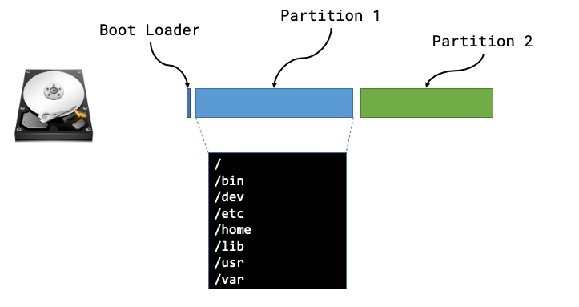

# The Basics of Deploying an Operating System

This guide covers deploying Operating Systems, this is important as not all Operating Systems are designed to be deployed in the same manner.
Some Operating Systems depend on being laid out on a disk in a specific way, some are almost completely dependent on actually being "installed" and others can be easily automated for quick deployment but require additional steps to customise afterwards.

## Getting an Operating System Deployed

Most Operating Systems are deployed in relatively the same manner:

1. A machine boots and reads from installation media (presented locally or over the network).
2. The target disks are prepared, typically partitions may be created or HA technologies such as disk mirroring and then finally these partitions are “formatted” so that they contain a file system.
3. Either a minimal set of packages or a custom selection of packages will be installed to the new file system.
   Most Operating Systems or distributions have their own concept of “packages” but ultimately under the covers the package contains binaries and required libraries for an application along with some logic that dictates where the files should be written too along with some versioning information that the package manager can use.
4. There may be some final customization such as setting users, network configuration etc..
5. A Boot loader is written to the target disk so that when the machine is next powered on it can boot the newly provisioned Operating System.

The order of the steps may differ but pretty much all of the major Operating Systems (Linux, Windows, MacOS) follow the same pattern to deploy on target hardware.

## Options for Automating a Deployment

There are usually two trains of thought when thinking about deploying an Operating System, which are scripted which will go through the steps listed above but no user interaction is required or image based which takes a copy of a deployment and uses that as a “rubber stamp” for other installs.

### Scripted

Operating Systems were originally designed to be ran on hardware of a predetermined configuration, which meant that there was no need for customizing of the installation.
However as time passed a few things happened that suddenly required Operating Systems to become more flexible:

- Usage of computers sky rocketed
- The number of hardware vendors producing compute parts increased
- A lot of traditional types of work became digitized.

All of these factors suddenly required an Operating System to support more and more types of hardware and it’s required configuration(s), furthermore end-users required the capability to tailor an Operating System to behave as needed.
To provide this functionality Operating System vendors built rudimentary user interfaces that would ask questions or provide the capability for a user installing the OS to set various configuration options.
This worked for a period of time but as more and more computer systems were deployed this became an administrative nightmare, as it was impossible to automate multiple installations as they required interaction to proceed and finally the need for humans to interact brings about the possibility of human error during the deployment.

In order for large scale IT system installations to take place then operations needed a method for [unattended installations](<https://en.wikipedia.org/wiki/Installation_(computer_programs)>), where installations can happen without any involvement.
The technique for this to work was to modify the Operating System installation code so that it could take a file that can answer all of the questions that would have previously required user input in order to progress the installation.
These technologies are all named in a way that reflects that:

- preseed
- answer file(s)
- kickstart
- jumpstart

Once a member of the operations team has “designed” the set of responses for their chosen Operating System then this single configuration can be re-used as many times as required.
This removes the human element from accidentally entering the wrong data or clicking the wrong button during an Operating System installation and ensures that the installation is standardized and “documented”.

**However**, one thing to consider is that although a scripted installation is a repeatable procedure that requires no human interaction it is not always 100% reliable.
This installation still runs through a **lot** of steps, such as every package has to be installed along with the prerequisite package management along with configuring devices and other things that happen during that initial installation phase.
Whilst this may work perfectly on the initial machine undiscovered errors can appear when moving this installation method to different hardware.
There have been numerous issues caused by packages relying on `sleep` during an installation step, the problem here usually is due to this package being developed on a laptop and then moved to much larger hardware.
Suddenly this `sleep` is no longer in step with the behavior of the hardware as the task completes much quicker than it had on slower hardware.
This has typically led to numerous installation failures and can be thought of as a race-condition.

### Image

Creating an image of an existing Operating System has existed for a long time, we can see it referenced in this [1960s IBM manual](https://web.archive.org/web/20140701185435/http://www.demorton.com/Tech/$OSTL.pdf) for their mainframes.
To understand imaging, we first need to understand the anatomy of a physical block device.

#### Anatomy of a disk

We can usually think of a disk being like a long strip of paper starting at position 0 and ending with the length of the strip of paper (or its capacity).
The positions are vitally important as they’re used by a computer when it starts in order to find things on disk.

The **Boot sector** is the first place a machine will attempt to boot from once it has completed its hardware initialization and hardware checks the code in this location will be used in order to instruct the computer where to look for the rest of the boot sequence and code.
In the majority of examples a computer will boot the first phase from this boot sector and then be told where to look for the subsequent phases and more than likely the remaining code will live within a partition.

A **partition** defines some ring-fenced capacity on an underlying device that can be then presented to the underlying hardware as usable storage.
Partitions will then be “formatted” so that they have a structure that understands concepts such as folders/directories and files, along with additional functionality such as permissions.



Now that we know the makeup of a disk we can see that there are lots of different things that we may need to be aware of, such as type of boot loader, size or number of partitions, type of file systems and then the files and packages that need installing within those partitions.

We can safely move away from all of this by taking a full copy of the disk!
Starting from position 0 we can read every byte until we’ve reached the end of the disk (EOF) and we have a full copy of _everything_ from boot loaders to partitions and the underlying files.

The steps for creating and using a machine image are usually:

- Install an Operating System once (correctly)
- Create an image of this deployed Operating System
- Deploy the “golden image” to all other hosts

### Filesystem archives

The other alternative that is common for Operating System deployment is a hybrid of the two above, and involves an a compressed archive of all files that would make up the Operating System.
It usually requires the block devices on the server to have been partitioned and formatted in advance in order for the files in the archive to be written to the filesystem.
Once the contents of the archive have been written to the filesystem, the remaining steps are to install a boot loader and perform and post-installation configuration (accounts/network configuration).

#### Creating a filesystem archive

A number of Linux Distributions provide a root file system archive that can already be downloaded quite easily, or a method to create your own:

- [Ubuntu](http://cdimage.ubuntu.com/ubuntu-base/releases/20.04/release/)
- [Debian](https://wiki.debian.org/Debootstrap)
- [Arch](https://archive.archlinux.org/iso/) (The `rootfs` is in the format `archlinux-bootstrap-<version>-<arch>.tar.gz`)

We can also make use of root file systems created by the Docker maintainers

```
TMPRFS=$(docker container create ubuntu:latest)
docker export $TMPRFS > rootfs.tar
docker rm $TMPRFS
```

Finally there is plenty of tooling to create your own root file systems, a good example is [livemedia-creator](https://weldr.io/lorax/livemedia-creator.html).
