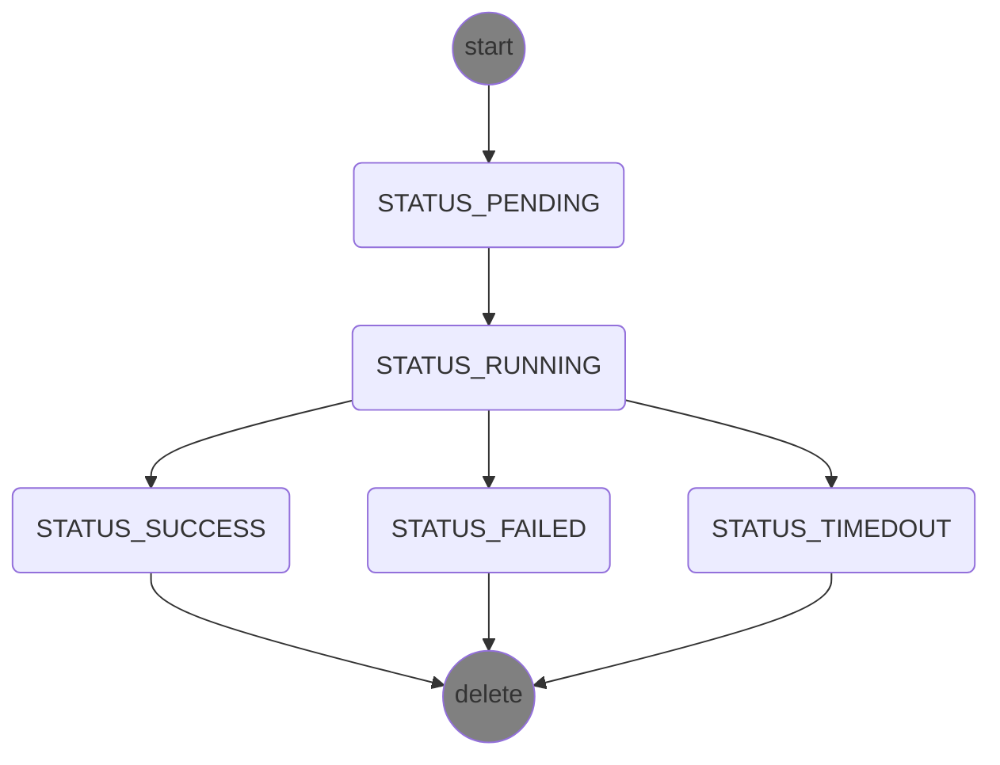

# Working with Workflows

A workflow is the Tinkerbell mechanism to put a provision task in motion. A workflow is defined in a YAML file, described later.
Prior to considering workflow yaml creations, a user will typically have created a set hardware and template YAML files - reflecting 
- the hardware under Tinkerbell control.
- the distros and their particular configuration available for use.

Once a suite of the above are created and _kubectl applied_ to the Tinkerbell stack, these remain dormant. A workflow _primes_ the Tinkerbell system in a state to flash an identified target device with an identified distro. We stress prime here as the actual workflow is triggered via a iPXE boot from the specific device - be that via Rufio for BMC managed hardware or a simple manual reboot of more consumer devices.

Workflow files themselves are relatively trivial - they only contain three field of specific relevance:

- unique name of a workflow
- unique identifier of the hardware, as defined in the hardware YAML definition.
- unique identified of the template to be used, as defined in the template YAML definition.

Hence, while we may have only a handful of template files, one can expect the max number of template files we might have under revision control is essentially the number of template files multiplied by the number of hardware files. This to help further explain the relationship between these three file types.

Updating a template or hardware data does not update existing workflows.

## Workflow YAML Definition

Below is an example of a typical workflow YAML file's content. When creating similar, the pattern to follow is as follows:
- `metadata.name`; You may have your own naming convention, just ensure it is unique across all your workflow files.
- `metadata.namespace`; Ensure this matches the k8s namespace you have deployed Tinkerbell into.
- `templateRef`; this is the reference to the template YAML you with to invoke. You acquire this from your template YAML file
- `hardwareRef`; this is the reference to the specific hardware you want the template to be run on. It is acquired from your hardware yaml file.
- `device_1` again, this is the MAC address of the hardware under focus. For devices with multiple NICs, think of this as the MAC that iPXE procedure is serviced on.

```yaml

apiVersion: "tinkerbell.org/v1alpha1"
kind: Workflow
metadata:
  name: wf1
  namespace: default
spec:
  templateRef: debian
  hardwareRef: sm01
  hardwareMap:
    device_1: 3c:ec:ef:4c:4f:54
```

## The Lifecycle of a Workflow
Once you have created your workflow YAML file, the next aspect to consider is the lifecycle of a workflow. This can best be depicted in the following diagram.



- The `start` state represents the time you have created the YAML file, but have not yet applied it to the Tinkerbell system.
- Execute `kubectl -n [tink namespace] apply -f myworkflowfile.yaml` to introduce the workflow to Tinkerbell. 
- If your file is well formed, you should see its state by executing `kubectl -n [tink namespace] get workflow`
- The system sits in the `STATUS_PENDING` state until it received an external stimulus. This is the target hardware issuing a iPXE request.
- The state of the workflow will move to `STATUS_RUNNING` on receipt of a DHCP/iPXE request for this device.
- Now the workflow is in operation, which essentially translates to the execution of all the actions described in the associated template YAML definition.
- Tinkerbell will move the workflow state to either `STATUS_SUCCESS`, `STATUS_FAILED` or `STATUS_TIMEDOUT`. The names are self explanatory.

The transition to the `delete` state above reflect a `kubectl -n [tink namespace] delete wf1` operation. The earlier three states indicate the completion of this workflow instance. The state remains accessible to the user to help understand the result of the workflow. However this instance is now inert from an operations point of view. To re-run this workflow, you need to delete and re-apply it to Tinkerbell. A workflow is only ever primed and ready to work when in its `STATUS_PENDING` state.

You can view a workflow's details either by:
```
kubectl -n [tink namespace] get workflow
```
or for a more detailed view:
```
kubectl -n [tink namespace] describe workflow wf1
```

## Details of Workflow Execution

On the first boot, the Worker is PXE booted, asks Boots for it's IP address, and loads into `hook`.
It then asks the `tink-server` for workflows that match its MAC or IP address.
Those workflows are then executed onto the Worker.

![Architecture]

If there are no workflows defined for the Worker, the Provisioner will ignore the Worker's request.
If as a part of the workflow, a new OS is installed and completes successfully, then the boot request (after reboot) will be handled by newly installed OS.
If as a part of the workflow, an OS is **not** installed, then the Worker after reboot will request PXE-boot from the Provisioner.

You can view the events and the state of a workflow during or after its execution with the kubernetes operation:
```
kubectl -n [tink namespace] get workflow
```
or for a more detailed view:
```
kubectl -n [tink namespace] describe workflow wf1
```

## Ephemeral Data

Ephemeral data is data that is shared between Workers as they execute workflows.
Ephemeral data is stored at `/workflow/<workflow_id>` in each tink-worker.

Initially the directory is empty; you populate with it by having the actions of a [template] write to it.
Then, the content in `/workflow/<workflow_id>` is pushed back to the database and from the database, pushed out to the other Workers.

As the workflow progresses, subsequent actions on a Worker can read any ephemeral data that's been created by previous actions on other Workers, as well as update that file with any changes.
Ephemeral data is only preserved through the life of a single workflow.
Each workflow that executes gets an empty file.

The data can take the form of a light JSON like below, or some binary files that other workers might require to complete their action.
There is a 10 MB limit for ephemeral data, because it gets pushed to and from the tink-server and tink-worker with every action, so it needs to be pretty light.

For instance, a Worker may write the following data:

```json
{
  "instance_id": "123e4567-e89b-12d3-a456-426655440000",
  "mac_addr": "F5:C9:E2:99:BD:9B",
  "operating_system": "ubuntu_18_04"
}
```

The other worker may retrieve and use this data and eventually add some more:

```json
{
  "instance_id": "123e4567-e89b-12d3-a456-426655440000",
  "ip_addresses": [
    {
      "address_family": 4,
      "address": "172.27.0.23",
      "cidr": 31,
      "private": true
    }
  ],
  "mac_addr": "F5:C9:E2:99:BD:9B",
  "operating_system": "ubuntu_18_04"
}
```

You can get the ephemeral data associated with a workflow with the `tink workflow data` tink CLI command.

[architecture]: /images/workflow-diagram.png
[hardware data]: /hardware-data
[template]: /templates
